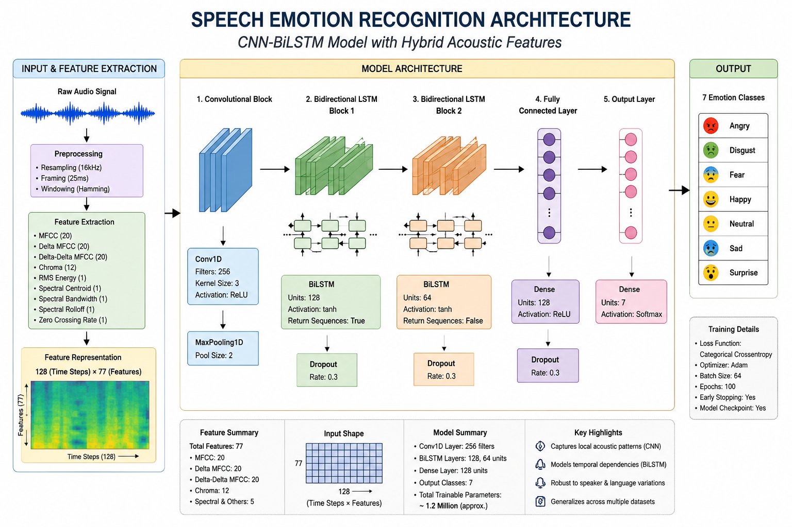
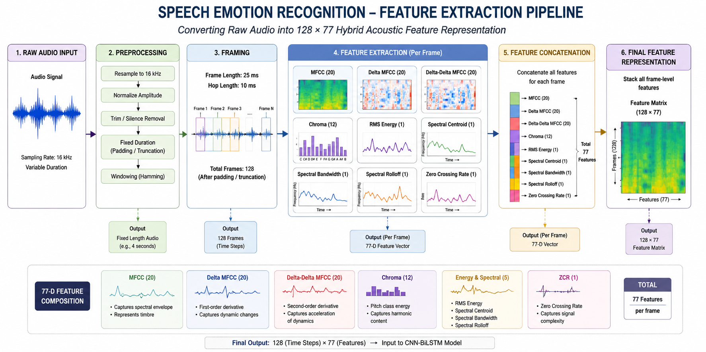
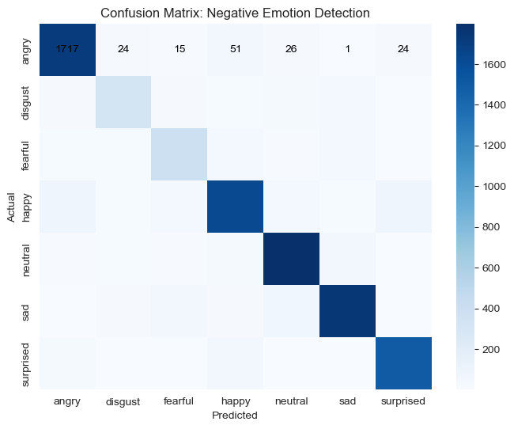
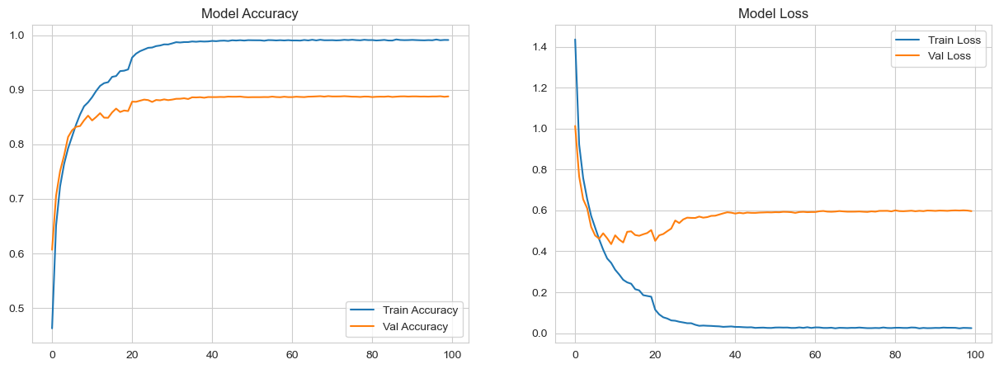
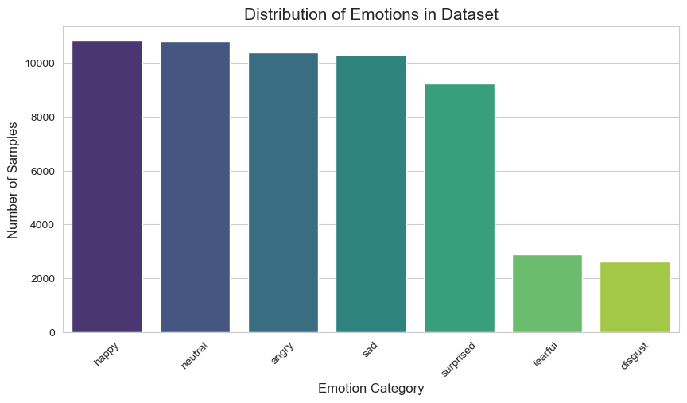

# 🎙️ Real-Time Speech Emotion Recognition using CNN-BiLSTM

A deep learning based Speech Emotion Recognition (SER) system capable of identifying human emotions from speech signals using hybrid acoustic features and a CNN-BiLSTM architecture.

The project was developed in two phases:

* **Phase 1:** Single-dataset learning using the RAVDESS emotional speech corpus.
* **Phase 2:** Cross-lingual multi-dataset learning using 8 public emotional speech datasets containing over **50,000 speech samples**.

The final model achieved **88.82% classification accuracy** across seven emotion categories.

---

# 📌 Supported Emotions

* Angry
* Disgust
* Fear
* Happy
* Neutral
* Sad
* Surprise

---

# 📊 Project Evolution

| Version            | Dataset    | Accuracy |
| ------------------ | ---------- | -------: |
| SER-01             | RAVDESS    |   50.56% |
| SER-02             | RAVDESS    |   77.78% |
| SER-03             | RAVDESS    |   82.64% |
| Multi-Dataset SER  | 8 Datasets |   88.68% |
| Multi-Dataset SER2 | 8 Datasets |   88.82% |

### Overall Improvement

**50.56% → 88.82%**

Absolute Gain: **+38.26 percentage points**

Relative Improvement: **+75.7%**

---

# 🌍 Datasets Used

## Phase 1

* RAVDESS

## Phase 2

* RAVDESS
* CREMA-D
* TESS
* SAVEE
* EMO-DB
* ESD
* Hindi Emotional Speech Corpus
* JL Emotional Speech Corpus

### Dataset Scale

| Metric           | Value                                     |
| ---------------- | ----------------------------------------- |
| Total Datasets   | 8                                         |
| Languages        | English, Hindi, German, Chinese, Japanese |
| Total Samples    | 50,000+                                   |
| Training Samples | 40,972                                    |
| Test Samples     | 10,244                                    |

---

# 🔬 Feature Engineering

Each speech sample is converted into a fixed-length **128 × 77 feature representation**.

## Acoustic Features

| Feature Type       |  Count |
| ------------------ | -----: |
| MFCC               |     20 |
| Delta MFCC         |     20 |
| Delta-Delta MFCC   |     20 |
| Chroma             |     12 |
| RMS Energy         |      1 |
| Spectral Centroid  |      1 |
| Spectral Bandwidth |      1 |
| Spectral Rolloff   |      1 |
| Zero Crossing Rate |      1 |
| **Total**          | **77** |

---

# 🏗️ Model Architecture

Input: **128 × 77 Feature Matrix**

```text
Input
  │
  ▼
Conv1D (256 Filters)
  │
  ▼
MaxPooling1D
  │
  ▼
BiLSTM (128 Units)
  │
  ▼
Dropout
  │
  ▼
BiLSTM (64 Units)
  │
  ▼
Dropout
  │
  ▼
Dense Layer
  │
  ▼
Softmax (7 Emotions)
```

The CNN layer captures local acoustic patterns while the BiLSTM layers learn temporal emotional dynamics across speech sequences.

---

# 📈 Results

## Final Performance

| Metric         | Value   |
| -------------- | ------- |
| Accuracy       | 88.82%  |
| Macro F1 Score | ~0.85   |
| Classes        | 7       |
| Datasets       | 8       |
| Samples        | 50,000+ |

---

# 🖼️ Visualizations

The repository includes:

* Dataset Distribution Analysis
* Feature Extraction Pipeline
* CNN-BiLSTM Architecture Diagram
* Confusion Matrix
* Accuracy & Loss Curves

Located inside:

```text
assets/
├── architecture.png
├── feature_extraction_pipeline.png
├── dataset_distribution.png
├── confusion_matrix.png
└── accuracy_loss_curve.png
```

## Architecture



## Feature Extraction Pipeline



## Confusion Matrix



## Accuracy/Loss Curve



## Dataset Distribution



---

# 📂 Repository Structure

```text
Speech-Emotion-Recognition-using-CNN-BiLSTM/
│
├── README.md
├── LICENSE
├── requirements.txt
├── .gitignore
│
├── notebooks/
│   ├── phase1/
│   │   ├── RAVDESS data distribution.ipynb
│   │   ├── SER 01.ipynb
│   │   ├── SER 02.ipynb
│   │   └── SER 03.ipynb
│   │
│   └── phase2/
│       ├── Data Loading.ipynb
│       ├── SER.ipynb
│       └── SER2.ipynb
│
├── assets/
│   ├── architecture.png
│   ├── feature_extraction_pipeline.png
│   ├── dataset_distribution.png
│   ├── confusion_matrix.png
│   └── accuracy_loss_curve.png
│
├── results/
│   ├── ravdess_results.md
│   └── multidataset_results.md
│
└── data/
    └── README.md
```

---

# 🚀 Installation

Clone the repository:

```bash
git clone https://github.com/Iam-Jai-Kumar/Speech-Emotion-Recognition-using-CNN-BiLSTM
cd Speech-Emotion-Recognition-using-CNN-BiLSTM
```

Install dependencies:

```bash
pip install -r requirements.txt
```

Launch Jupyter Notebook:

```bash
jupyter notebook
```

---

# 📝 Reproducing Experiments

### Phase 1 (RAVDESS)

Run notebooks sequentially:

```text
RAVDESS data distribution.ipynb
SER 01.ipynb
SER 02.ipynb
SER 03.ipynb
```

### Phase 2 (Multi-Dataset)

Run notebooks sequentially:

```text
Data Loading.ipynb
SER.ipynb
SER2.ipynb
```

---

# 🔮 Future Improvements

* Wav2Vec2 Feature Embeddings
* CNN-BiLSTM + Transformer Hybrid Models
* Attention-Based Emotion Recognition
* Conformer Architectures
* Speaker-Independent Evaluation
* Real-Time Streaming Inference
* Model Quantization for Edge Deployment

---

# 📚 Citation & Dataset Acknowledgement

This project uses several publicly available Speech Emotion Recognition datasets.

All datasets remain the intellectual property of their respective creators, institutions, and authors. The datasets are used solely for academic and research purposes.

If you use this project in research or derivative work, please cite the original dataset publications and follow their respective licenses and usage policies.

Datasets used include:

* RAVDESS
* CREMA-D
* TESS
* SAVEE
* EMO-DB
* ESD
* Hindi Emotional Speech Corpus
* JL Emotional Speech Corpus

---

# 🛠️ Tech Stack

* Python
* TensorFlow / Keras
* Librosa
* NumPy
* Pandas
* Scikit-Learn
* Matplotlib
* Seaborn
* Jupyter Notebook

---

# 👨‍💻 Author

**Jai Kumar**

B.Tech, Computer Science and Engineering

National Institute of Technology Patna (NIT Patna)
